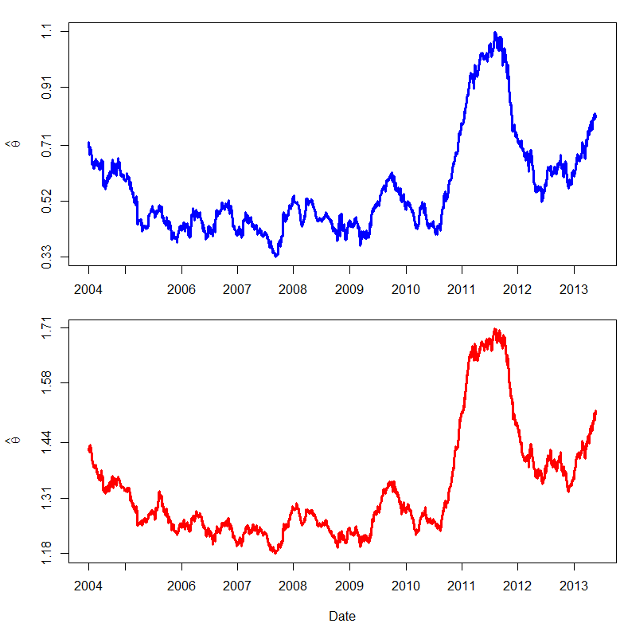

[](http://quantlet.de/)

## [](http://quantlet.de/) **SFEdynCop3dim** [](http://quantlet.de/)

```yaml

Name of QuantLet: SFEdynCop3dim

Published in: Statistics of Financial Markets

Description: 'plots the time series from estimated dependence parameter for
              the copula families Clayton and Gumbel. The empirical residuals 
              are calculated using moving window of size 250'

Keywords: garch, copula, plot, gumbel, clayton

See also: BCS_ClaytonMC, SFEstaticCop, SFEdynCop2dim, dynamic

Author: Ostap Okhrin, Piedad Castro

Submitted: Tue, June 28 2016 by Piedad Castro

Input: 'The datafile contains daily price data from 07.05.2004 to 07.05.2014 for 
selected companies which are part of DAX30 and FTSE100 as well as the 
corresponding index data. This code makes use of the daily prices for the companies
Bayer, Deutsche Telekom and Volkswagen. It uses the date variable as well.'

Output: 'Plot: Dependence parameter of Gaussian (upper panel), Clayton (middle panel) and Gumbel (lower panel) copulae.'

Code warning: 'There were 50 or more warnings (use warnings() to see the first 50)'

```



### R Code
```r

# clear variables and close windows
rm(list = ls(all = TRUE))
graphics.off()

# set working directory
# setwd("C:/...")

# install and load packages
libraries = c("data.table", "fGarch", "copula")
lapply(libraries, function(x) if (!(x %in% installed.packages())) {
  install.packages(x)
})
lapply(libraries, library, quietly = TRUE, character.only = TRUE)

# load data
dataset = fread("2004-2014_dax_ftse.csv", select =  c("BAYER", "DEUTSCHE TELEKOM", "VOLKSWAGEN"))
dataset = as.data.frame(dataset)

# log-returns
X = lapply(dataset, 
           function(x){
             diff(log(x))
           })

X = as.data.frame(X)

r.window   = 250        # size of moving window
T.obs      = nrow(X)

# in these objects will be saved the estimation of the dependence parameter
par.clay.cop  = NULL
par.gum.cop   = NULL


dimen       = ncol(X)
gumbel.cop  = gumbelCopula(1.5, dim = dimen)
clayton.cop = claytonCopula(1.5, dim = dimen)


for (s in r.window:T.obs){
  X.part = X[(s - r.window + 1):s, ]
  
  garchModel = lapply(X.part, 
                      function(x){
                        garchFit(~garch(1, 1), data = x, trace = F)
                      })
  
  eps = lapply(garchModel, 
               function(x){
                 x@residuals/x@sigma.t
               })
  
  # making margins uniform, based on Ranks
  eps = lapply(eps, 
               function(x){
                 rank(x)/(r.window + 1)
               })
  
  eps = as.matrix(as.data.frame(eps))
  
  fit.ml.gumbel  = fitCopula(gumbel.cop, eps, method="mpl")@estimate
  fit.ml.clayton = fitCopula(clayton.cop, eps, method="mpl")@estimate
  
  par.gum.cop   = c(par.gum.cop, fit.ml.gumbel)
  par.clay.cop  = c(par.clay.cop, fit.ml.clayton)
  
  print(s) # control
}

# Date variable
data.time      = fread("2004-2014_dax_ftse.csv", select =  c("Date"))
data.time      = data.time$Date[-1]
data.time      = data.time[1:(T.obs - r.window + 1)]
data.time.Year = as.integer(format(as.Date(data.time, "%Y-%m-%d"), "%Y"))
date.ind       = which(c(1, diff(data.time.Year)) == 1)
date.labels    = data.time.Year[1]:(data.time.Year[1] + length(date.ind) - 1)

# Plot of the estimated dependence parameter
layout(matrix(c(1,2), 2, 1, byrow = FALSE))

par(mai = c(0.7, 0.9, 0.3, 0.1))
plot(par.clay.cop, type = "l", lwd = 3, xlab = "", ylab = expression(hat(theta)), col = "blue", axes = F, frame = T)
axis(1, date.ind, date.labels)
y.labels = c(round(seq(min(par.clay.cop), max(par.clay.cop), length = 5) * 100) / 100, 0 )
axis(2, y.labels, y.labels)

par(mai = c(1, 0.9, 0, 0.1))
plot(par.gum.cop, type = "l", lwd = 3, xlab = "Date", ylab = expression(hat(theta)), col = "red", axes = F, frame = T)
y.labels = c(round(seq(min(par.gum.cop), max(par.gum.cop), length = 5) * 100) / 100, 0 )
axis(1, date.ind, date.labels)
axis(2, y.labels, y.labels)

```

automatically created on 2018-05-28