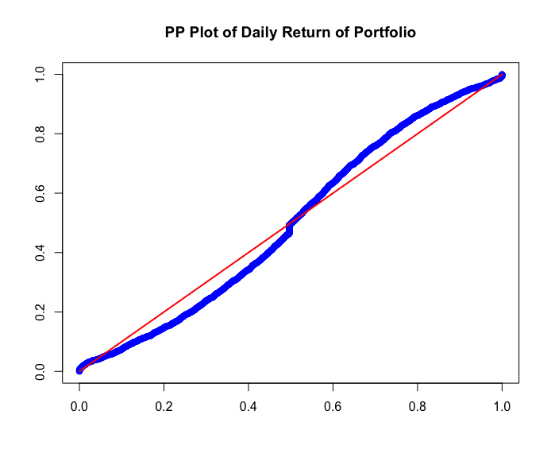
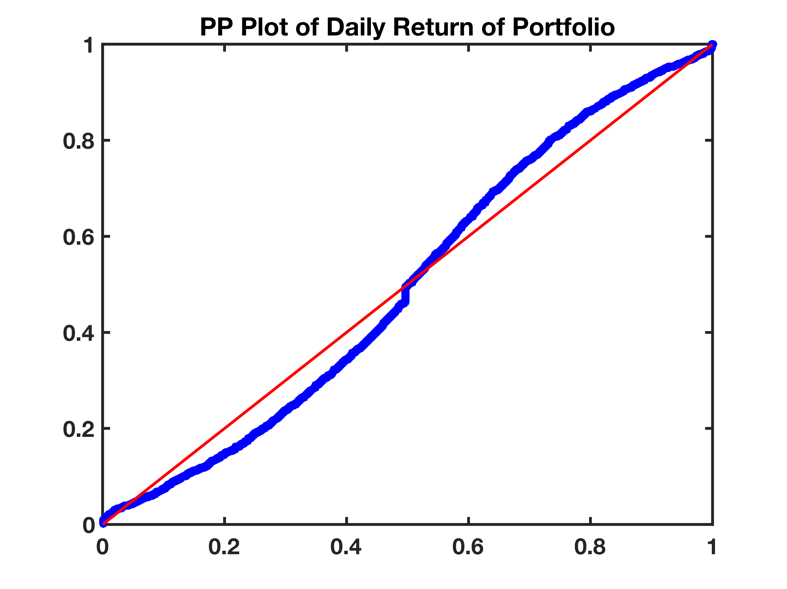
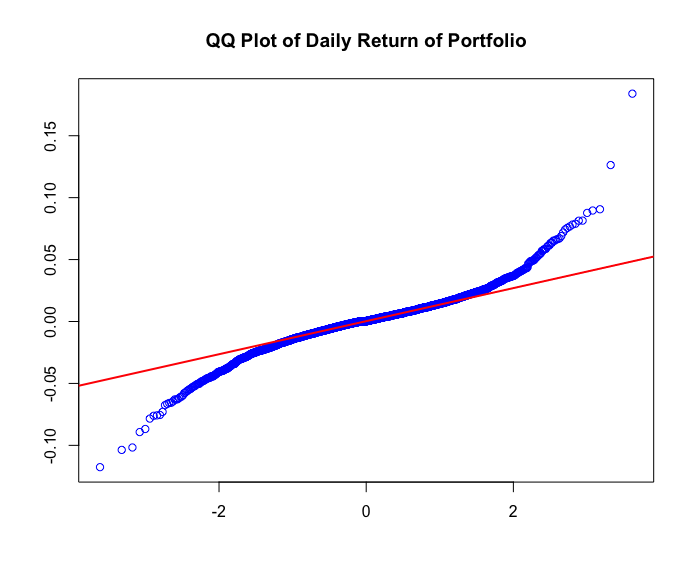
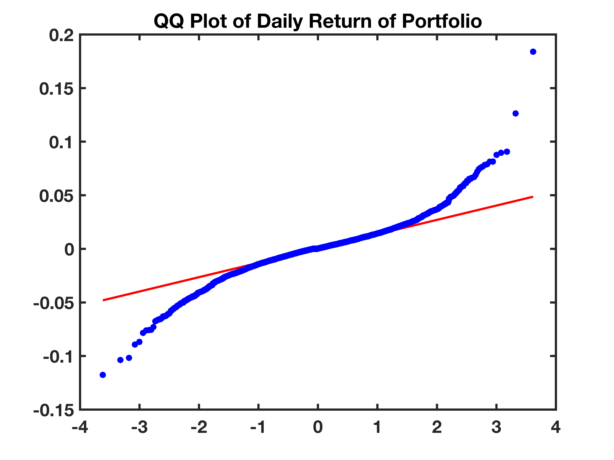

[](http://quantlet.de/)

## [](http://quantlet.de/) **SFEportfolio** [](http://quantlet.de/)

```yaml

Name of QuantLet : SFEportfolio
Published in: Statistics of Financial Markets
Description: 'Produces a PP and a QQ plot of the daily return of the optimal (variance efficient) portfolio'
Keywords:
- portfolio
- financial
- multivariate normal
- normal-distribution
- plot
- portfolio
- risk
See also:
- SFEclose
- SFEportlogreturns
- SFEtailGEV_pp
- SFEtailGEV_qq
- SFEtailGPareto_pp
- SFEvar_block_max_backtesting
Author:
- Awdesch Melzer
Author[Matlab]: 
- Awdesch Melzer
Submitted[Matlab]: Fri, November 29 2013 by Awdesch Melzer
Datafiles: BAYER_close_0012.dat, BMW_close_0012.dat, SIEMENS_close_0012.dat, VW_close_0012.dat
Example: 'PP and QQ plots of the daily returns of the variance efficient portfolio'
```









### R Code
```r

rm(list=ls(all=TRUE))
graphics.off()


x1 = read.table("BAYER_close_0012.dat")
x2 = read.table("BMW_close_0012.dat")
x3 = read.table("SIEMENS_close_0012.dat")
x4 = read.table("VW_close_0012.dat")

r1 = diff(as.matrix(log(x1)))
r2 = diff(as.matrix(log(x2)))
r3 = diff(as.matrix(log(x3)))
r4 = diff(as.matrix(log(x4)))

# Variance efficient portfolio
portfolio = cbind(r1,r2,r3,r4)
opti      = solve(cov(portfolio))%*%c(1,1,1,1)
opti      = opti/sum(opti)
returns2  = as.matrix(portfolio)%*%opti
x         = returns2
n         = nrow(x)
xf        = apply(x,2,sort)
t         = (1:n)/(n+1)
dat1      = cbind(pnorm((xf-mean(xf))/sd(xf)),t)
dat2      = cbind(t,t)

#PP Plot
plot(dat1,col="blue",ylab="",xlab="",main="PP Plot of Daily Return of Portfolio")
lines(dat2,col="red",lwd=2)

#QQ Plot
qqnorm(xf,col="blue",xlab="",ylab="",main="QQ Plot of Daily Return of Portfolio")
qqline(xf,col="red",lwd=2)
```

automatically created on 2018-09-04

### MATLAB Code
```matlab

close all
clear 
clc

% Load data
x1 = load('BAYER_close_0012.dat');
x2 = load('BMW_close_0012.dat');
x3 = load('SIEMENS_close_0012.dat');
x4 = load('VW_close_0012.dat');

r1 = diff(log(x1));
r2 = diff(log(x2));
r3 = diff(log(x3));
r4 = diff(log(x4));

% Variance efficient portfolio
portfolio = [r1,r2,r3,r4];
opti      = inv(cov(portfolio))*[1,1,1,1]';
opti      = opti/sum(opti);
returns2  = portfolio*opti;
x         = returns2;
n         = size(x,1);
xf        = sort(x);
t         = [(1:n)/(n+1)]';
dat1      = [normcdf((xf-repmat(mean(xf),n,1))/std(xf)),t];
dat2      = [t,t];


%PP Plot
figure(1)
h1 = plot(dat1(:,1),dat1(:,2),'bo');
set(h1(1),'Marker','o','MarkerEdgeColor','none','MarkerFaceColor','b')
hold on
h1 = plot(dat2(:,1),dat2(:,2),'r-','LineWidth',2);
title('PP Plot of Daily Return of Portfolio','FontSize',16,'LineWidth',2,'FontWeight','bold')
set(gca,'FontSize',16,'LineWidth',2,'FontWeight','bold');
set(gca,'XTick',[0:0.2:1])
set(gca,'XTickLabel',{0,0.2,0.4, 0.6,0.8,1.0})
set(gca,'YTick',[0:0.2:1])
set(gca,'YTickLabel',{0,0.2,0.4, 0.6,0.8,1.0})
print -painters -dpdf -r600 SFEportfolio01.pdf
print -painters -dpng -r600 SFEportfolio01.png
hold off

%QQ Plot
figure(2)
h = qqplot(xf);
hold on
set(h(1),'Marker','o','MarkerEdgeColor','none','MarkerFaceColor','b')
set(h(3),'LineStyle','-')
set(h(3),'LineWidth',2)
title('QQ Plot of Daily Return of Portfolio','FontSize',16,'LineWidth',2,'FontWeight','bold');
xlabel('')
ylabel('')
box on
xlim([-4 4])
set(gca,'FontSize',16,'LineWidth',2,'FontWeight','bold');
hold off
print -painters -dpdf -r600 SFEportfolio02.pdf
print -painters -dpng -r600 SFEportfolio02.png
```

automatically created on 2018-09-04