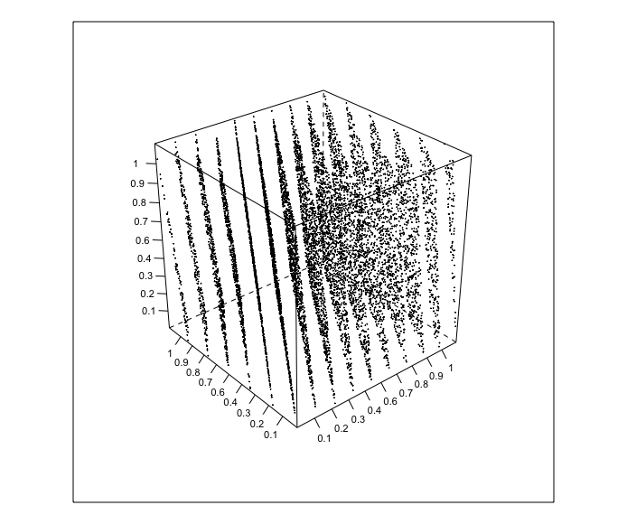
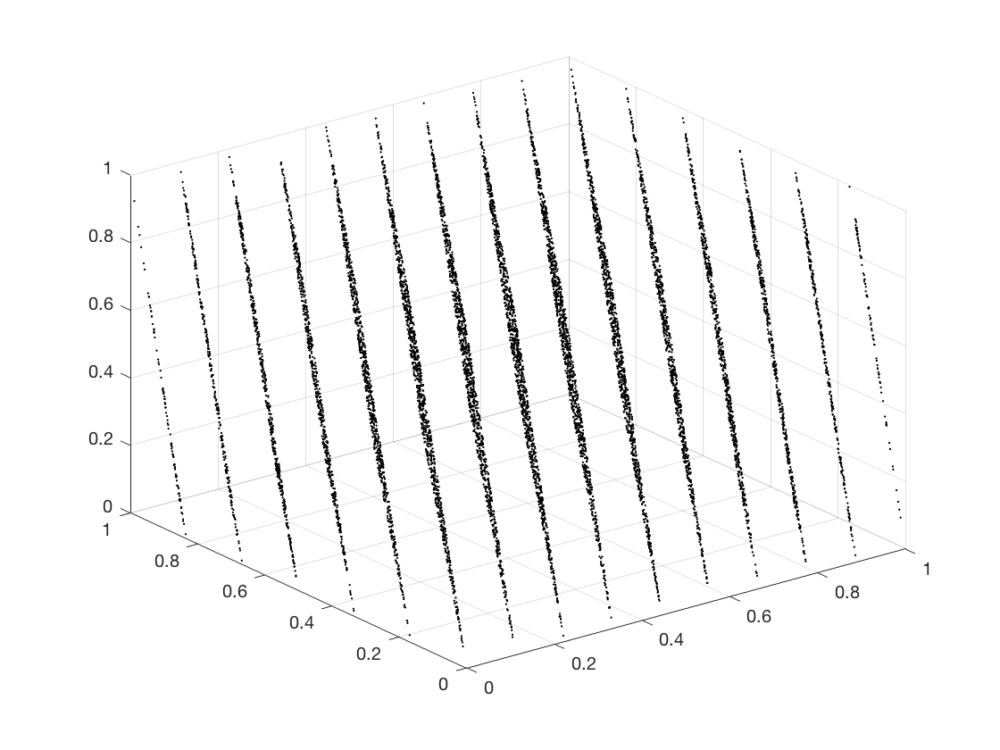

[](http://quantlet.de/)

## [](http://quantlet.de/) **SFErandu** [](http://quantlet.de/)

```yaml

Name of QuantLet : SFErandu
Published in: Statistics of Financial Markets
Description: 'Produces 3d plot of hyperplanes of pseudo-random uniform numbers for given values of sample size and seed'
Keywords:
- random
- random-number-generation
- randu
- simulation
- uniform
- monte-carlo
See also:
- SFENormalApprox1
- SFENormalApprox3
- SFENormalApprox4
- SFEfibonacci
- SFEgamma
- SFErangen1
- SFErangen2
- SFEtheta
- SFEvega
- SFEvolga
Author:
- Awdesch Melzer
Author[Matlab]: 
- Wolfgang K. Haerdle
Submitted[Matlab]: Wed, December 23 2009 by Lasse Groth
Example: 'a 3d plot of uniform random numbers is generated for the following values of the parameters: n=10000, seed=1298324'
```





### R Code
```r

rm(list = ls(all = TRUE))
graphics.off()

# install and load packages
libraries = c("TeachingDemos", "lattice")
lapply(libraries, function(x) if (!(x %in% installed.packages())) {
  install.packages(x)
})
lapply(libraries, library, quietly = TRUE, character.only = TRUE)

# parameter settings
n       = 10000     # sample size
a       = 2^16 + 3
M       = 2^31
seed    = 1298324   # makes sure that the same numbers are generated each time the quantlet is executed
y       = NULL

# main computation
y[1] = seed
i = 2
while (i <= n) {
  y[i] = (a * y[i - 1])%%M
  i = i + 1
}
y = y/M

# output
rotate.cloud(y[3:n] ~ y[1:(n - 2)] + y[2:(n - 1)], xlab = "", ylab = "", zlab = "", 
             type = "p", scales = list(arrows = FALSE, col = "black", distance = 1, 
             tick.number = 8, cex = 0.7, x = list(labels = round(seq(0, 1, length = 10), 
             1)), y = list(labels = round(seq(0, 1, length = 10), 1)), z = list(labels = 
             round(seq(0, 1, length = 10), 1))), col = "black", pch = 20, cex = 0.1)
```

automatically created on 2018-09-04

### MATLAB Code
```matlab

clear
clc
close all

% Input parameters
n    = 10000;         % sample size
seed = 1298324;    % makes sure that the same numbers are generated each time
                 % the quantlet is executed

% Main computation
y(1) = seed;
a    = 2^16 + 3;
M    = 2^31;
i    = 2;
while(i<=n)
    y(i) = mod((a*y(i-1)),M);
    i    = i+1;
end
y = y/M;

% Output
scatter3(y(1:n-2),y(2:n-1),y(3:n),'k','.')
```

automatically created on 2018-09-04