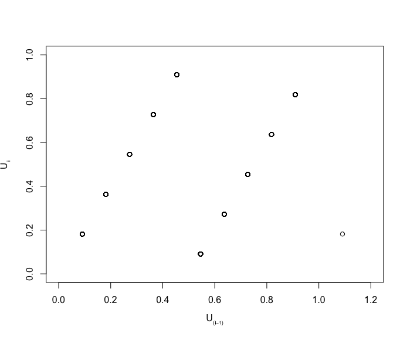
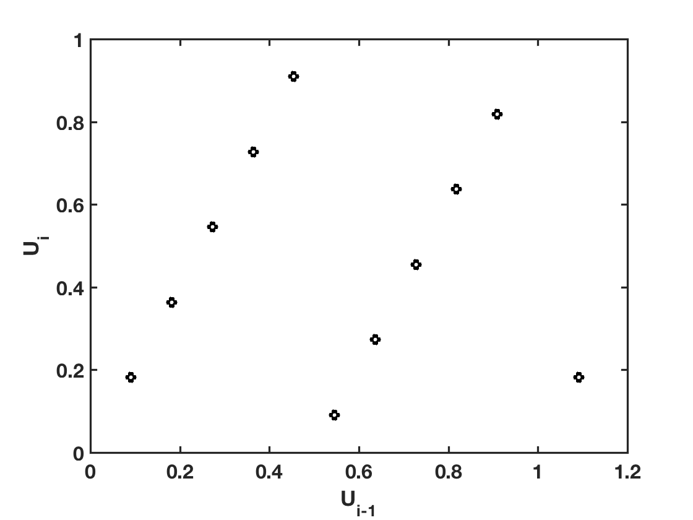

[](http://quantlet.de/)

## [](http://quantlet.de/) **SFErangen1** [](http://quantlet.de/)

```yaml

Name of QuantLet : SFErangen1
Published in: Statistics of Financial Markets
Description: 'Generates pseudo-random uniform numbers and shows hyperplane pairs of the generate numbers'
Keywords:
- random
- random-number-generation
- randu
- simulation
- uniform
- monte-carlo
See also:
- SFENormalApprox1
- SFENormalApprox3
- SFENormalApprox4
- SFEfibonacci
- SFEgamma
- SFErandu
- SFErangen2
- SFEtheta
- SFEvega
- SFEvolga
Author:
- Awdesch Melzer
Author[Matlab]: 
- Wolfgang K. Haerdle
Submitted[Matlab]: Wed, December 23 2009 by Lasse Groth
Input[Matlab]:
- Params: n (sample size), a (the multiplier), b (the increment), M (the modulus), seed
Example: 'A plot is provided for parameter values of: n=1000, a=2, b=0, M=11, seed=12'
```





### R Code
```r

# clear variables and close windows
rm(list=ls(all=TRUE))
graphics.off()


# input parameters
n    = 1000;
a    = 2;
b    = 0;
M    = 11;
seed = 12;
y    = NULL;

# main computation
y[1] = seed;
i    = 2;

while (i<=n){
    y[i]=(a*y[i-1]+b)%%M; # modulus
    i=i+1;
}

y = y/M;

# output
plot(y[1:(n-2)],y[2:(n-1)],col="black", xlab=c(expression(U*bold(scriptstyle(atop(phantom(1),(i-1)))))), 
     ylab=c(expression(U*bold(scriptstyle(atop(phantom(1),i))))), xlim=c(0,1.2),ylim=c(0,1))

```

automatically created on 2018-09-04

### MATLAB Code
```matlab

clear
clc
close all

% input parameters
n    = 1000;
a    = 2;
b    = 0;
M    = 11;
seed = 12;

% main computation
y(1) = seed;
i    = 2;

while(i<=n)
    y(i)= mod((a*y(i-1)+b),M);
    i   = i+1;
end
y = y/M;

% output
scatter(y(1:n-2),y(2:n-1),'k','LineWidth',3)
xlabel('U_i_-_1','FontSize',16,'FontWeight','Bold')
ylabel('U_i')
xlim([0 1.2])
box on
set(gca,'LineWidth',1.6,'FontSize',16,'FontWeight','Bold')
```

automatically created on 2018-09-04