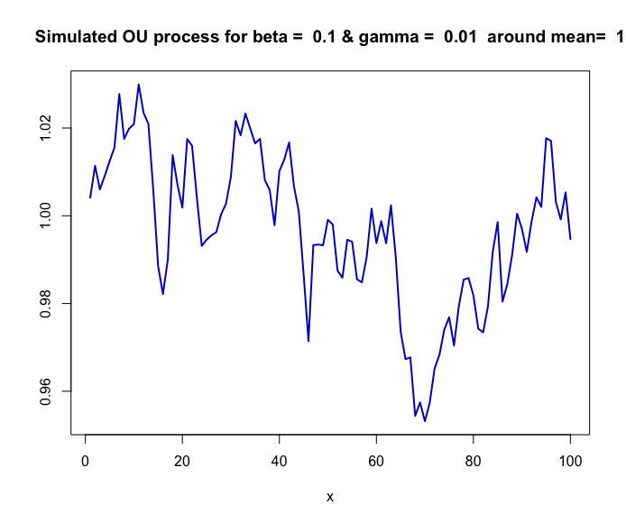
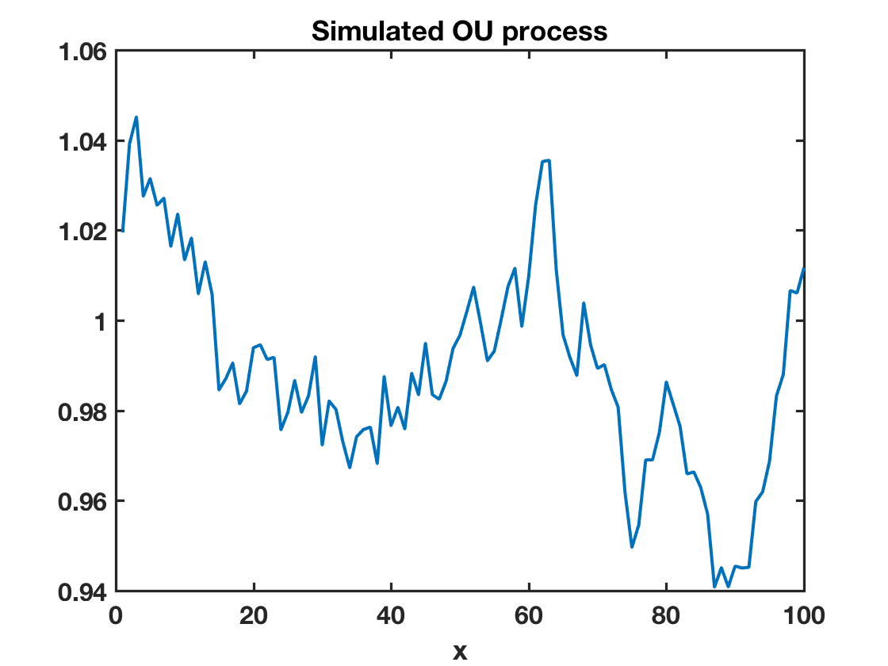

[](http://quantlet.de/)

## [](http://quantlet.de/) **SFEsimOU** [](http://quantlet.de/)

```yaml

Name of QuantLet: SFEsimOU
Published in: Statistics of Financial Markets
Description: 'Plots a simulated Ornstein-Uhlenbeck process using the parameters given by the user'
Keywords:
- ornstein-uhlenbeck
- stochastic
- stochastic-process
- simulation
- monte-carlo
Author[Matlab]: Torsten Kleinow
Submitted[Matlab]: Sat, November 10 2012 by Dedy Dwi Prastyo
Input[Matlab]:
- Params: num. of obs., beta, gamma, mean
Example: 'Plot of a simulated Ornstein-Uhlenbeck process'
```





### R Code
```r

# clear all variables anc close windows
rm(list=ls(all=TRUE))
graphics.off()

set.seed(1) # set pseudo random numbers

n       = 100   # number of observations
beta    = 0.1   # beta parameter
gamma   = 0.01  # gamma parameter
m       = 1     # mean

# simulates a mean reverting square root process around m
i     = 0
delta = 0.1
x     = m     # start value

while (i<(n*10)){
    i   = i+1
	d   = beta*(m - x[length(x)])*delta + gamma*sqrt(delta)*rnorm(1,0,1)
	x   = rbind(x, x[length(x)]+d)
}

x     = x[2:length(x)]
ind   = 10*(1:n)
x     = x[ind]

#plot
plot(x,type="l",col="blue3", lwd=2,xlab="x",ylab="")
title(paste("Simulated OU process for beta = ", beta,"& gamma = ", gamma," around mean= ", m))

```

automatically created on 2018-05-28

### MATLAB Code
```matlab

clear
close all
clc


% User inputs parameters
disp('Please input # of observations n, beta, gamma, mean m as: [100, 0.1, 0.01, 1]') ;
disp(' ') ;
para = input('[# of observations, beta, gamma, mean]=');
while length(para) < 4
    disp('Not enough input arguments. Please input in 1*4 vector form like [100, 0.1, 0.01, 1] or [100 0.1 0.01 1]');
    para=input('[# of observations, beta, gamma, mean]=');
end

n     = para(1);
beta  = para(2);
gamma = para(3);
m     = para(4);

% Simulates a mean reverting square root process around m
i     = 0;
delta = 0.1;
x     = m;        % start value
while (i<(n*10))
    i = i+1;
    d = beta*(m - x(length(x)))*delta + gamma*sqrt(delta)*randn(1);
    x = [x; x(length(x))+d];
end

x=x(2:length(x));
ind = 10*(1:1:n);
x = x(ind);
  
% Make plot
plot(x, 'LineWidth',2)
title('Simulated OU process','FontSize',16,'FontWeight','Bold');
xlabel('x','FontSize',16,'FontWeight','Bold')
box on
set(gca,'LineWidth',1.6,'FontSize',16,'FontWeight','Bold')
```

automatically created on 2018-05-28