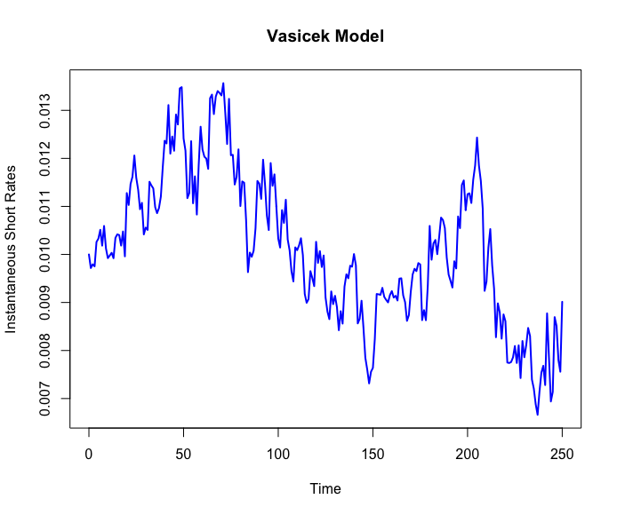
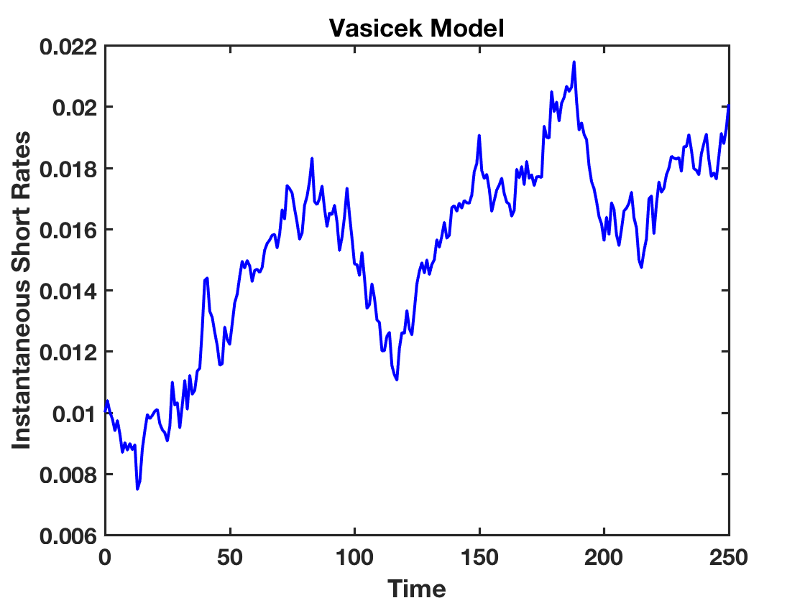

[](http://quantlet.de/)

## [](http://quantlet.de/) **SFEsimVasi** [](http://quantlet.de/)

```yaml

Name of QuantLet: SFEsimVasi
Published in: Statistics of Financial Markets
Description: 'Plots a simulated Vasicek process using the parameters given by the user'
Keywords:
- vasicek
- stochastic
- stochastic-process
- simulation
- monte-carlo
Author[Matlab]: Li Sun
Submitted[Matlab]: Fri, February 05 2010 by Lasse Groth
Input[Matlab]:
- Parameters: 'a (speed of reversion), b (long term mean), sigma (instantaneous volatility), r0 (initial short rate), T (time to maturity)'
Example: 'Plot of a simulated Vasicek process'
```





### R Code
```r

# clear variables and close windows
rm(list=ls(all=TRUE)) 
graphics.off()

set.seed(100)

# Parameters of Vasicek process (a, b, sigma) 
a     = 0.161      # adjustment factor
b     = 0.014      # long term average interest rate    
sigma = 0.009  # instantaneous standard deviation
R0    = 0.01      # instantaneous forward rate
T     = 250        # time period
dt    = 1         # time intervals
N     = T/dt #Number of  time intervals of length dt in long  time period T

#The initial short rate
R    = NULL
R[1] = R0

# Simulation of the short rates
for (i in 1:N){
	R[i+1] = R[i]+a*(b-R[i])*(1/N)+sigma*sqrt(1/N)*rnorm(1,mean=0,sd=1)
}

# Plot for the Short Rates vs Time
x = seq(0,T,dt)
plot(x,R,col="blue",type="l",lwd=2, xlab="Time",ylab="Instantaneous Short Rates", main="Vasicek Model")
```

automatically created on 2018-05-28

### MATLAB Code
```matlab

clear
clc
close all

% user inputs parameters
disp('Please input [a, b, sigma, r0, T] as: [0.161, 0.014, 0.009, 0.01, 250]') ;
disp(' ') ;
para=input('[a, b, sigma, r0, T] as =');

while length(para) < 5
    disp('Not enough input arguments. Please input in 1*5 vector form like [0.161, 0.014, 0.009, 0.01, 250]');
    para=input('[a, b, sigma, r0, T] as =');
end

a     = para(1);   %adjustment factor
b     = para(2);   %long term average interest rate    
sigma = para(3);  %instantaneous standard deviation
R0    = para(4);   %instantaneous forward rate
T     = para(5);   %time period
dt    = 1;         %time intervals
N     = T/dt;     %Number of  time intervals of length dt in long  time period T
R(1)  = R0;      %The initial short rate

%% simulation of the short rates

for i=1:N
    R(i+1) = R(i)+a*(b-R(i))*(1/N)+sigma*sqrt(1/N)*normrnd(0,1);
end

%% plot for the Short Rates vs Time

x = 0:dt:T;
plot(x,R,'b-','LineWidth',2);
xlabel('Time','FontSize',16,'FontWeight','Bold')
ylabel('Instantaneous Short Rates')
title('Vasicek Model')
box on
set(gca,'LineWidth',1.6,'FontSize',16,'FontWeight','Bold')
```

automatically created on 2018-05-28